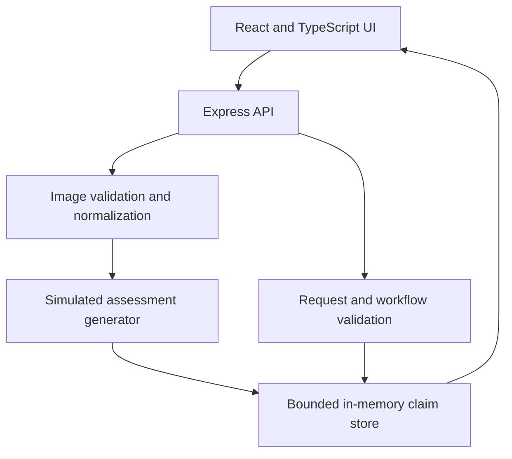

# AutoAssess AI

A full-stack prototype for vehicle-damage assessment and human-reviewed insurance claims.

**This is a simulation:** damage items, vehicle attributes, costs, reasoning and confidence scores are generated independently of the uploaded image. No vision model runs, scores are not calibrated probabilities, and no reports or repair authorizations are sent externally.

## Problem and approach

Claims agents need to review damage, adjust repair estimates and decide when specialist review is appropriate. This prototype explores that workflow through seven seeded mock claims and new image uploads. A reviewer can edit severity, repair actions and costs, save notes, approve an estimate or flag it for manual review.

## Architecture



- **Frontend:** React 18, Vite, TanStack Query, Wouter, Tailwind CSS and shadcn/ui.
- **Backend:** Express, Zod request validation and Sharp image decoding.
- **Storage:** in-memory claims. PostgreSQL/Drizzle definitions remain as optional scaffolding; they are not connected to the current workflow.
- **Review:** confidence indicators are illustrative guidance. They do not automatically escalate a claim or block approval. Approved and flagged claims are final within the demo and cannot be edited through the API.

## Run locally

Use **Node.js 22.12 or newer** and npm (Node 20.19+ is also supported). The project supplies `.nvmrc` for Node 22; CI checks Node 20, 22 and 24.

```bash
git clone https://github.com/raghid-shreih/autoassess-ai.git
cd autoassess-ai
npm ci
npm run dev
```

Open **http://localhost:5000**. Express serves the API and Vite frontend together. No database, AI API key or environment file is required. `PORT` is optional; for example, on macOS/Linux:

```bash
PORT=5001 npm run dev
```

Scripts use `cross-env` to set the application mode on Windows as well as macOS/Linux.

```bash
npm run check
npm test
npm run build
npm start
```

The last command serves the production build at the same port. Keep development dependencies installed when using `npm start`, since the startup script uses `cross-env`.

## Implemented workflow

1. Select a seeded claim or upload a JPG, PNG or WEBP image up to 10 MB and 16 megapixels.
2. Review the illustrative damage items and estimate; edit severity, repair action and non-negative costs.
3. Save draft notes, or submit notes together with approval/manual review.
4. Reopen the claim to see saved notes and status. All data resets when the server restarts.

Uploads are checked in the browser and decoded again on the server. Accepted images are normalized to JPEG, resized to at most 1280 pixels on either axis, and stripped of metadata. Animated images are not supported. Full uploaded images and agent notes are omitted from list responses; seeded static images provide list thumbnails. Uploads show a placeholder in the list and remain available in the detail view.

## API

| Method | Endpoint | Body / behavior |
|---|---|---|
| GET | `/api/claims` | Small claim summaries |
| GET | `/api/claims/:id` | Full claim with image, damages and notes |
| POST | `/api/claims/assess` | `{ "imageData": "data:image/png;base64,..." }` |
| PATCH | `/api/claims/:claimId/damage/:damageId` | One or more of `severity`, `action`, `laborCost`, `partsCost` |
| PATCH | `/api/claims/:id/notes` | `{ "notes": "Review notes" }` |
| POST | `/api/claims/:id/approve` | Optional `{ "notes": "Final notes" }` |
| POST | `/api/claims/:id/flag` | Optional `{ "notes": "Reason for review" }` |

Invalid fields return 400, missing resources 404, and mutations to completed claims 409. Costs must be finite, non-negative and at most $1,000,000 per field; notes have a 5,000-character limit. Assessment requests are limited to 10 per minute per client IP; the store accepts at most 50 claims including the seven seeds. Reaching either limit returns 429. Restart the demo to reset claim capacity. When running behind a proxy, request limits may be shared by clients; proxy trust should be configured only for a known deployment topology.

## Engineering decisions

- **Validate at the API boundary:** TypeScript types do not validate incoming JSON. Strict Zod schemas constrain editable fields and keep identifiers and illustrative confidence scores immutable.
- **Enforce final states server-side:** hiding controls in the UI is insufficient. The storage layer rejects changes after approval or escalation.
- **Keep image work separate from simulation:** real image decoding handles uploads; the simulation never claims to infer damage from pixels.
- **Bound the demo:** upload limits, resizing, request limiting and claim capacity reduce avoidable memory growth. API logs contain method, status and timing rather than claim/image payloads.
- **Verify behavior:** regression tests cover upload validation, cost updates and totals, draft notes, final-state locks, errors, capacity and request limits. CI runs installation, type checking, tests, build and dependency audit.

## Repository structure

```text
client/          React application
server/          API, image processing and in-memory workflow
shared/          Types, validation schemas and optional database definitions
script/          Production build
attached_assets/ Demo JPEGs and original draft PRD
tests/          API regression tests and image fixture
.github/         CI configuration
```

The draft PRD in `attached_assets/` describes a broader product vision, including functionality this prototype does not implement. It is not an implementation specification or evidence of model performance.

## Limitations and next steps

This demo has no authentication, authorization, durable storage, audit history, genuine model evaluation, insurer pricing integration or repair authorization workflow. It is intended for synthetic data and local demonstrations, not production insurance decisions. A publicly hosted instance shares its claim data between visitors; use only demonstration images and notes.

Next steps are persistent storage and audit trails, identity and access controls, integration of an evaluated vision model, calibrated uncertainty, and pricing data. The prototype has not measured claims accuracy, processing-time savings or business ROI.

## License

Original project code is licensed under [MIT](LICENSE). The code license does not grant rights to third-party materials or extend to documents/images in `attached_assets/` or the test image fixture.
